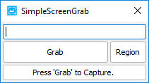
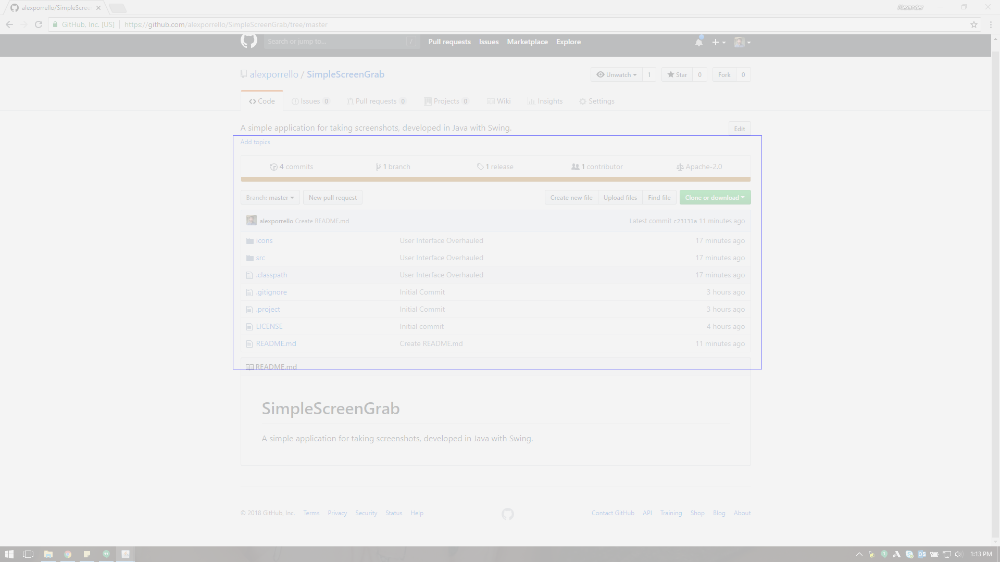

# SimpleScreenGrab

In its current form, SimpleScreenGrab is a nifty little application designed to streamline the process of creating screenshots.
It might even be a little bit too simple. The functionality is extremely limited, but we plan on adding more features on a day-to-day
basis. If you have any good ideas (or maybe even bad ones--why the heck not?) go ahead and post a comment on the _Feature Additions_ Issue.

## Getting Started

Taking a screenshot is as easy as 1, 2, and (sometimes) 3:

1. Enter the filename in the text field at the top of the window.
2. Press the _Grab_ button to capture the main screen or the _Region_ button to capture an area of the main screen. If you pressed the _Region_ button proceed to the final step. Otherwise, you're done! 
3. If you pressed the _Region_ button, your main monitor will go grey. Click and drag to draw a box around the part of the scren you'd like to capture:

If you'd like to cancel the capture, right-click your mouse, and the grey will vanish.

Whether you captured the entirety of the main screen or a region, the screenshot will have been automatically saved to your _Documents_ directory in a folder called _SimpleScreenGrabs_.